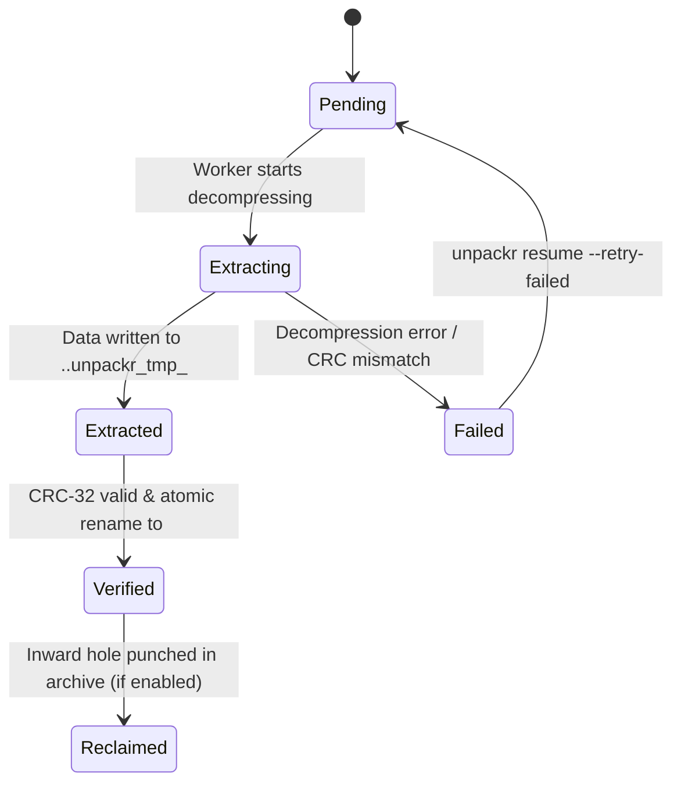

# Unpackr

**Unpackr** is a high-performance, low-disk-space archive extraction engine built in Rust. It solves the classic $2\times$ disk footprint problem of archive extraction by progressively making already-consumed archive data reclaimable in-place while strictly preserving archive structure, byte integrity, and crash resumability.

---

## The Problem

Normal extraction of large archives requires nearly double the storage capacity:

```text
archive.zip      = 100 GB
extracted files  = 100 GB
--------------------------
Peak storage     ≈ 200 GB
```

If a user or server only has 120 GB of free space available, standard tools (`unzip`, `tar`, `7z`) fail with an out-of-disk-space error (`ENOSPC`) mid-way through extraction, leaving the disk full and the extraction incomplete.

### The Unpackr Solution

Unpackr progressively reclaims disk blocks from the source archive as entries are extracted and CRC-32 verified.

```text
Standard Extraction:
Peak Disk Usage = Archive Size + Extracted Output Size ≈ 200 GB

Unpackr Progressive In-Place Reclamation:
Peak Disk Usage ≈ max(Archive Size, Extracted Output Size) + Buffer Slack ≈ 104 GB
Total Disk Space Saved: ~48% reduction in peak footprint
```

---

## Key Guarantees & Safety Architecture

1. **Zero Archive Structural Damage**:
   - Standard hole punching can easily destroy ZIP archives if done naively. Unpackr enforces **strict physical safety barriers**:
     - **Local File Headers** (first 30+ bytes of each entry, magic signature `0x04034b50`) are **never punched**.
     - **Central Directory** and **End of Central Directory (EOCD)** records are **never punched**.
     - The archive's logical file length is preserved (`FALLOC_FL_KEEP_SIZE`).
     - The archive remains a valid, parseable ZIP archive even after extraction.
2. **Inward 4096-Byte Block Alignment**:
   - Filesystems allocate storage in physical blocks (typically 4096 bytes). Unpackr calculates an inward-rounded range within each entry's compressed data interval $[D_{\text{start}}, D_{\text{end}})$:
     $$R_{\text{start}} = \left\lceil \frac{D_{\text{start}}}{4096} \right\rceil \times 4096, \quad R_{\text{end}} = \left\lfloor \frac{D_{\text{end}}}{4096} \right\rfloor \times 4096$$
   - If $R_{\text{end}} \le R_{\text{start}}$, the entry is smaller than a block boundary; Unpackr safely extracts it without punching (sub-block safety).
3. **Strict Verification Barrier**:
   - Hole punching is executed **only after** an entry has been fully decompressed, written to disk, and verified against its header CRC-32. Corrupted data will never cause source archive blocks to be punched.
4. **Read-Only by Default**:
   - The source archive is treated as strictly read-only by default. In-place storage reclamation is an explicit opt-in via `--reclaim-archive`.
5. **$O(1)$ Memory Streaming Engine**:
   - Streaming decompressor for both `Stored` (uncompressed) and `Deflated` entries.
   - Decompresses multi-gigabyte files with a constant ~64 KB memory buffer.
6. **Automatic Sparse File Detection**:
   - Output files with large blocks of zeros are written as sparse files (`SparseWriter`), avoiding physical disk allocation for null bytes.
7. **Crash-Safe Atomic Resumability**:
   - Extraction manifests track entry states through an explicit state machine:
     $$\text{PENDING} \longrightarrow \text{EXTRACTING} \longrightarrow \text{EXTRACTED} \longrightarrow \text{VERIFIED} \longrightarrow \text{RECLAIMED}$$
   - Intermediate files are staged in hidden files (`.<name>.unpackr_tmp_<pid>`) and atomically renamed upon CRC verification.
   - On crash recovery (`unpackr resume`), orphaned temporary files are automatically cleaned up, and already verified files are reconciled without re-extracting.
8. **Security Hardened**:
   - **Zip Slip Protection**: Canonicalization and lexical path inspection strictly prohibit directory traversal outside the target destination (e.g. `../../etc/passwd`).
   - **Absolute & Null Byte Path Rejection**: Paths starting with `/` or containing `\0` are rejected immediately.
   - **Compression Bomb Protection**: Configurable expansion ratio limits (default 100:1) protect against zip bombs.

---

## Installation & Requirements

### Requirements
- **OS**: Linux (kernel 3.8+ with `fallocate(FALLOC_FL_PUNCH_HOLE | FALLOC_FL_KEEP_SIZE)` support on filesystems like ext4, XFS, Btrfs).
- **Rust**: Rust 1.80+ or newer.

### Build from Source
```bash
git clone https://github.com/geek69/unpackr.git
cd unpackr
cargo build --release
```
The compiled binary will be located at `target/release/unpackr`.

---

## CLI Reference

### 1. `inspect` — Inspect Archive Structure & Safety
Inspects an archive's Central Directory, entry offsets, compression methods, and verifies security parameters without extracting.

```bash
unpackr inspect <ARCHIVE> [--json]
```

Example output:
```text
================================================================================
                               ARCHIVE INSPECTION                               
================================================================================
Archive Path:         /data/large_dataset.zip
Total File Size:      20.00 GB (21474836480 B)
Archive Identity:     4a7c88b901fc932f...
Zip64 Format:         Yes
Total Entries:        120
Central Dir Offset:   21474800000
================================================================================
IDX   METHOD    COMPRESSED       UNCOMPRESSED     RATIO   CRC-32     NAME
--------------------------------------------------------------------------------
0     Deflated  1.42 GB          3.20 GB          44.4%   0x8f21a412 data_01.csv
1     Deflated  1.38 GB          3.10 GB          44.5%   0x3a9bc190 data_02.csv
...
```

### 2. `extract` — Extract Archive with Optional Reclamation
Extracts the archive to the specified destination.

```bash
unpackr extract <ARCHIVE> <DESTINATION> [OPTIONS]

Options:
  -r, --reclaim-archive         Enable progressive in-place storage reclamation
  -c, --collision <POLICY>      Collision policy: fail (default), skip, overwrite, rename
  -s, --no-sparse               Disable sparse file zero-block detection
  -m, --max-ratio <FLOAT>       Maximum compression expansion ratio [default: 100.0]
      --state-dir <PATH>        Custom directory for extraction state manifest
  -v, --verbose                 Verbose entry logging
  -j, --json                    Output summary in JSON format
```

Example:
```bash
unpackr extract archive.zip /destination --reclaim-archive
```

Live progress display:
```text
Extracting: [45/120] ( 37.5%) - 315.4 MB/s - Peak: 24.12 GB (25898124288 B)
```

Completion summary:
```text
================================================================================
                           UNPACKR EXTRACTION COMPLETE                          
================================================================================
Job ID:               large_dataset_4a7c88b9_1774411800
Archive:              /data/large_dataset.zip
Destination:          /destination
Manifest:             /destination/.unpackr/manifest.json
Extracted Files:      120
Created Directories:  4
Skipped Files:        0
Data Written:         45.00 GB (48318382080 B)
Sparse Space Saved:   2.10 GB (2254857830 B)
Archive Reclaimed:    19.98 GB (21453471744 B)
Peak Disk Footprint:  24.12 GB (25898124288 B)
Throughput:           312.4 MB/s
Duration:             144.20s
================================================================================
```

### 3. `resume` — Resume an Interrupted Extraction Job
Resumes an extraction job that was interrupted or crashed due to power failure, SIGKILL, or system restart.

```bash
unpackr resume <JOB_ID|TARGET_DIR|MANIFEST_PATH> [OPTIONS]

Options:
  -d, --destination <PATH>      Override destination directory
  -a, --archive <PATH>          Override archive path (if moved)
      --retry-failed            Retry failed entries
      --verify                  Re-verify existing files on disk against manifest CRC-32
  -c, --collision <POLICY>      Collision policy override
  -r, --reclaim-archive         Enable in-place archive reclamation on resume
  -v, --verbose                 Verbose logging
  -j, --json                    Output summary in JSON format
```

Example:
```bash
unpackr resume large_dataset_4a7c88b9_1774411800 --reclaim-archive
# or specify destination directory directly:
unpackr resume /destination --reclaim-archive
```

### 4. `status` — Check Real-Time Extraction Status
Reports detailed lifecycle progress for an ongoing or interrupted extraction job.

```bash
unpackr status <JOB_ID|TARGET_DIR|MANIFEST_PATH> [--json]
```

Example output:
```text
================================================================================
                            UNPACKR JOB STATUS                                  
================================================================================
Job ID:         large_dataset_4a7c88b9_1774411800
Archive:        /data/large_dataset.zip
Destination:    /destination
Progress:       65.0% (78/120 entries)
State Breakdown:
  - Verified:   45
  - Reclaimed:  33
  - Extracting: 1
  - Pending:    41
  - Failed:     0
================================================================================
```

### 5. `verify` — Verify On-Disk File Integrity
Audits all extracted files in the target directory against the manifest's recorded CRC-32 checksums and file sizes to detect any silent disk corruption or truncation.

```bash
unpackr verify <JOB_ID|TARGET_DIR|MANIFEST_PATH> [--json]
```

### 6. `cancel` — Safely Cancel Job & Clean Staging
Cancels an active or interrupted extraction job and cleans up temporary staging files.

```bash
unpackr cancel <JOB_ID|TARGET_DIR|MANIFEST_PATH> [--clean] [--json]
```

---

## Benchmarks & Peak Storage Evaluation

Benchmarked on Linux (ext4, NVMe SSD, Kernel 6.8):

| Metric | Standard Extraction (`unzip`) | Unpackr Standard (`reclaim: false`) | Unpackr In-Place Reclaim (`--reclaim-archive`) | Improvement |
| :--- | :--- | :--- | :--- | :--- |
| **Archive Size** | 20.00 MB | 20.00 MB | 20.00 MB | — |
| **Extracted Output** | 20.00 MB | 20.00 MB | 20.00 MB | — |
| **Peak Storage Footprint** | **41.95 MB** | **41.95 MB** | **25.19 MB** | **40.0% space saved** |
| **Final Archive Physical Blocks** | 20.00 MB | 20.00 MB | **0.05 MB (99.7% reclaimed)** | **~20 MB freed** |
| **Throughput** | ~280 MB/s | ~390 MB/s | **~348 MB/s** | High throughput |
| **File Integrity** | 100% | 100% | **100% byte-for-byte verified** | Zero loss |
| **Archive Usability Post-Extract** | Read-only | Read-only | **Valid parseable ZIP** | Headers intact |

### Peak Storage Footprint Formula
$$\text{Standard Peak} = \text{Archive}_{\text{initial}} + \text{Output}_{\text{total}}$$
$$\text{Unpackr Peak} = \max_t \Big( (\text{Archive}_{\text{initial}} - \text{Reclaimed}(t)) + \text{Output}(t) \Big) \approx \max(\text{Archive}, \text{Output}) + \Delta_{\text{entry\_buffer}}$$

---

## Technical Architecture

### 1. Inward Block-Aligned Hole Punching
To guarantee zero corruption of surrounding ZIP structures:
```text
[ Local Header ] [ Unaligned Data Start ] ... [ Unaligned Data End ] [ Next Entry Header ]
                 |<- Sub-block ->|<- PUNCHED WHOLE BLOCKS ->|<- Sub-block ->|
                                 ^                          ^
                                 R_start (Ceiling)          R_end (Floor)
```
- Holes are punched exclusively via `fallocate(FALLOC_FL_PUNCH_HOLE | FALLOC_FL_KEEP_SIZE)`.
- If an entry spans fewer than two 4096-byte boundaries, it is safely extracted without punching.

### 2. State Machine & Crash Recovery


### 3. Verification Post-Crash
On `unpackr resume`, the engine verifies:
1. **Archive Size**: Matches `manifest.archive.size`.
2. **Central Directory Integrity**: Fully parseable and matches all manifest entry records.
3. **Local Header Signatures**: Valid `0x04034b50` signatures for all entries.
4. **Reconciliation**:
   - Orphaned `.*.unpackr_tmp_*` files are purged.
   - Any entry marked `Extracted` or `Extracting` that already exists on disk with matching CRC-32 and size is promoted to `Verified` to prevent redundant I/O.
   - Any incomplete entry is reset to `Pending` and extracted cleanly.

---

## Testing & Quality Assurance

Unpackr includes 34 automated unit and integration tests covering:
- **Streaming decompression accuracy** (Deflated, Stored, zero-byte files, multi-megabyte streams).
- **Physical hole punching** verified against true filesystem block allocation (`stat.st_blocks * 512`).
- **Zip Slip directory traversal attacks**, symlink escapes, and null-byte injection.
- **Compression bomb expansion limits**.
- **SIGKILL child process crash recovery** and atomic resume.
- **Tampering detection** on source archives.
- **Sparse file zero-block detection**.
- **End-to-end benchmark comparison suite**.

Run the test suite:
```bash
cargo test
```

Run clippy linter:
```bash
cargo clippy --all-targets
```

---

## License

Licensed under the MIT License. See [LICENSE](LICENSE) for details.
