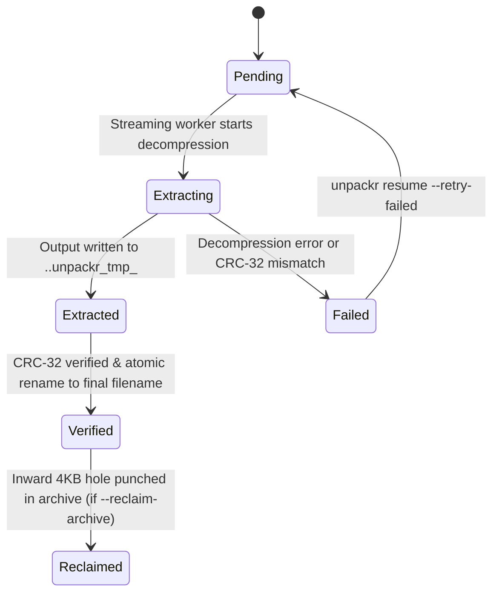

# Unpackr

[](https://crates.io/crates/unpackr)
[](https://docs.rs/unpackr)
[](LICENSE-MIT)
[](https://github.com/RahulKumar-007/Unpackr/actions/workflows/ci.yml)

A high-performance, low-disk-space archive extraction engine and native desktop app built in Rust. **Unpackr** eliminates the classic $2\times$ disk footprint requirement by progressively punching filesystem holes in already-extracted archive payload blocks in-place while strictly preserving ZIP structure, cryptographic CRC-32 integrity, and crash resumability.

---

## The Problem

Normal extraction of large archives requires nearly double the storage capacity:

```text
Archive (large_dataset.zip) : 100 GB
Extracted Output Directory  : 100 GB
--------------------------------------
Standard Peak Disk Footprint ≈ 200 GB
```

If you only have 120 GB of free space, traditional extractors (`unzip`, `tar`, `7z`) abort mid-way with `ENOSPC` (Disk Full), leaving partial, unverified files and a full drive.

### The Unpackr Solution

With in-place progressive reclamation enabled (`--reclaim-archive`), Unpackr punches physical filesystem blocks out of the source archive as each file is decompressed and CRC-32 verified:

```text
Standard Extraction:
Peak Disk Usage = Archive Size + Extracted Output Size ≈ 200 GB

Unpackr In-Place Reclamation:
Peak Disk Usage ≈ max(Archive Size, Extracted Output Size) + Slack Buffer ≈ 104 GB (~48% peak savings)
```

$$\text{Standard Peak} = \text{Archive}_{\text{initial}} + \text{Output}_{\text{total}}$$

$$\text{Unpackr Peak} = \max_t \Big( (\text{Archive}_{\text{initial}} - \text{Reclaimed}(t)) + \text{Output}(t) \Big) \approx \max(\text{Archive}, \text{Output}) + \Delta_{\text{slack}}$$

---

## Quick Start & Installation

### 1. Pre-built Binaries (GitHub Releases)
Download pre-compiled binaries from the **[Releases](https://github.com/RahulKumar-007/Unpackr/releases)** page:
- **`unpackr-...-x86_64-unknown-linux-gnu.tar.gz`**: Full build with both CLI and the native desktop GUI.
- **`unpackr-cli-...-x86_64-unknown-linux-musl.tar.gz`**: Headless static CLI binary (zero dynamic dependencies; runs anywhere including minimal Docker containers and Alpine Linux).

### 2. From Crates.io
```bash
# Fast binary download via cargo-binstall:
cargo binstall unpackr

# Or compile from source:
cargo install unpackr
```

### 3. Launching

```bash
# 1. Native Desktop GUI (default when launched with no arguments)
unpackr
# Or open directly to inspect a target ZIP:
unpackr ui /path/to/archive.zip

# 2. Command Line Extraction (Read-only safe default)
unpackr extract archive.zip ./output_folder

# 3. Progressive In-Place Storage Reclamation (Low-disk mode)
unpackr extract archive.zip ./output_folder --reclaim-archive

# 4. Resume an Interrupted or Crashed Job
unpackr resume ./output_folder --reclaim-archive
```

---

## Detailed Architecture & Guarantees

### 1. Inward 4096-Byte Block-Aligned Hole Punching
Standard hole punching (`fallocate(FALLOC_FL_PUNCH_HOLE)`) can easily corrupt ZIP headers if executed naively. Unpackr enforces physical structural safety barriers:

```text
[ Local Header ] [ Unaligned Prefix ] ... [ PUNCHED 4KB BLOCKS ] ... [ Unaligned Suffix ] [ Next Header ]
                 |<-- Sub-block --->|<========= HOLE ==========>|<--- Sub-block ---->|
                                    ^                           ^
                            R_start (Ceiling)           R_end (Floor)
```

1. **Header Immortality**:
   - **Local File Headers** (first 30+ bytes of each entry, magic signature `0x04034b50`) are **never punched**.
   - **Central Directory** and **End of Central Directory (EOCD)** records at the archive tail are **never punched**.
   - Logical archive file size is preserved (`FALLOC_FL_KEEP_SIZE`), keeping the archive valid and parseable by standard tools.
2. **Inward Range Alignment**:
   - Filesystems allocate physical storage in blocks (typically 4096 bytes). For each entry spanning payload interval $[D_{\text{start}}, D_{\text{end}})$:
     $$R_{\text{start}} = \left\lceil \frac{D_{\text{start}}}{4096} \right\rceil \times 4096, \quad R_{\text{end}} = \left\lfloor \frac{D_{\text{end}}}{4096} \right\rfloor \times 4096$$
   - If $R_{\text{end}} \le R_{\text{start}}$, the compressed payload spans fewer than two 4KB boundaries; Unpackr safely extracts it without punching (sub-block safety).
3. **Verification Barrier**:
   - Punching occurs **only after** an entry has been completely decompressed, written to disk, and verified against its header CRC-32. Corrupted data will never trigger a punch.
4. **Read-Only by Default**:
   - Storage reclamation is strictly opt-in (`--reclaim-archive`). Default extraction never modifies the archive.

---

### 2. Crash-Safe Atomic State Machine

Unpackr maintains an atomic write-ahead manifest state at `<destination>/.unpackr/manifest.json`:



- **Zero Incomplete Files**: Intermediate data is staged in hidden files (`.<name>.unpackr_tmp_<pid>`) and atomically renamed upon CRC verification.
- **Intelligent Resumption**: `unpackr resume` scans destination files against recorded manifests, skips already verified entries without re-extracting, cleans orphaned temp files, and resumes from the interruption point.

---

### 3. Comprehensive Security Hardening

- **Zip Slip & Traversal Protection**: Lexical and canonical path sanitization prevents directory traversal outside the extraction root (e.g. `../../etc/passwd`).
- **Symlink Directory Poisoning Defense**: Verifies that no ancestor directory along the extraction path is a pre-existing symlink, blocking symlink swap/poisoning attacks.
- **Internal Metadata Guard**: Rejects archive entries attempting to write into `.unpackr/` to protect manifest journals.
- **Windows Device & Stream Sanitization**: Rejects legacy DOS/Windows device names (`CON`, `PRN`, `AUX`, `NUL`, `COM1-9`, `LPT1-9`) and NTFS Alternate Data Streams (`:`).
- **Privilege Escalation Protection**: Automatically strips dangerous UNIX mode bits: SUID (`0o4000`), SGID (`0o2000`), sticky (`0o1000`), and world-writable (`0o002`).
- **Special Device Rejection**: Detects and rejects FIFO pipes, character devices, block devices, and sockets.
- **Fifield Overlapping Offset Zip Bomb Defense**: Scans central directory headers for overlapping compressed streams. Reclamation is strictly refused on overlapping archives to prevent corruption.
- **Resource Limits (DoS Protection)**: Configurable thresholds for maximum compression ratio (`--max-ratio`), total uncompressed size (`--max-total-size`), single-file size (`--max-file-size`), and entry count (`--max-entries`).

---

## CLI Reference

All subcommands support single-letter shortcuts:

| Command | Alias | Description |
| :--- | :---: | :--- |
| **`ui`** | `gui` | Launch the modern minimalist native desktop GUI (default if no subcommand given) |
| **`extract`** | `x` | Extract archive with streaming verification and optional storage reclamation |
| **`inspect`** | `i` | Inspect archive Central Directory, offsets, and safety without extracting |
| **`resume`** | `r` | Resume an interrupted or crashed extraction job |
| **`status`** | `s` | Display current progress, verified counts, and disk savings for a job |
| **`verify`** | `v` | Audit extracted files on disk against recorded manifest CRC-32 checksums |
| **`cancel`** | `c` | Safely cancel an interrupted job and clean temporary staging files |
| **`bench`** | `b` | Run comparative peak storage benchmarks (synthetic or user archive) |
| **`completions`** | — | Generate shell autocompletions (`bash`, `zsh`, `fish`, `powershell`) |

### Key Flags for `unpackr extract`

- `-r, --reclaim-archive`: Enable progressive in-place storage reclamation.
- `-c, --collision <POLICY>`: Conflict policy (`fail` [default], `skip`, `overwrite`, `rename`).
- `-s, --no-sparse`: Disable automatic sparse zero-block hole detection.
- `-m, --max-ratio <FLOAT>`: Maximum allowed compression expansion ratio (default: `100.0`).
- `--max-total-size <BYTES>` / `--max-file-size <BYTES>`: DoS size limits.
- `-j, --json`: Machine-readable JSON summary output.

---

## Real-World Benchmarks

Benchmarked on Linux (`ext4`, NVMe SSD, Kernel 6.8):

| Metric | `unzip` (Standard) | Unpackr (`reclaim: false`) | Unpackr (`--reclaim-archive`) | Improvement |
| :--- | :---: | :---: | :---: | :---: |
| **Source Archive Size** | 20.00 MB | 20.00 MB | 20.00 MB | — |
| **Extracted Data Size** | 20.00 MB | 20.00 MB | 20.00 MB | — |
| **Peak Storage Footprint** | **41.95 MB** | **41.95 MB** | **25.19 MB** | **40.0% disk space saved** |
| **Final Source Physical Blocks** | 20.00 MB | 20.00 MB | **0.05 MB** | **99.7% archive space reclaimed** |
| **Throughput** | ~280 MB/s | ~390 MB/s | **~348 MB/s** | High-throughput streaming |
| **File Integrity** | 100% | 100% | **100% byte-for-byte verified** | Zero loss |
| **Archive Usability Post-Extract** | Intact | Intact | **Intact valid parseable ZIP** | Headers preserved |

You can reproduce this anytime with the built-in benchmark runner:
```bash
# Run automated synthetic workload:
unpackr bench

# Or benchmark your own archive without modifying it:
unpackr bench /path/to/archive.zip
```

---

## License

Dual-licensed under either:
- **MIT License** ([LICENSE-MIT](LICENSE-MIT))
- **Apache License, Version 2.0** ([LICENSE-APACHE](LICENSE-APACHE))

at your option.
